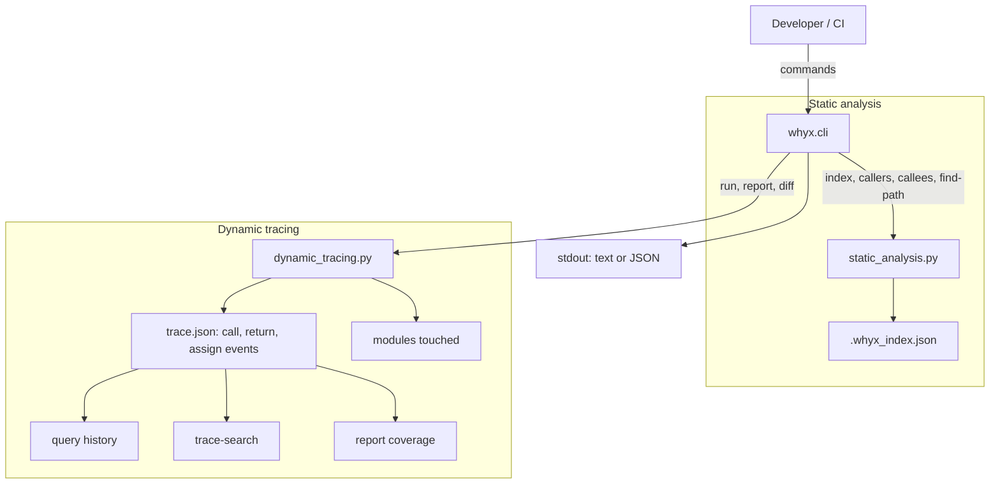

# whyx — Static & Dynamic Code Path Explorer

whyx is a minimal, open‑source CLI for exploring Python codebases in two complementary ways:

- **Static**: build a call graph from your source with a fast AST pass; query **callers**, **callees**, and find **paths** between functions.
- **Dynamic**: run scripts under lightweight tracing to capture **calls**, **returns**, **attribute assignments** (via watchpoints), and derive **coverage**; then **diff** traces between runs and **search** within them.

> Works entirely from the command line. No external services. JSON in, JSON out (if you want).

<p align="center">
<a href="#architecture-diagram">Jump to the diagram ↓</a>
</p>

---

## Table of Contents

- [whyx — Static \& Dynamic Code Path Explorer](#whyx--static--dynamic-code-path-explorer)
  - [Table of Contents](#table-of-contents)
  - [Features](#features)
  - [Requirements](#requirements)
  - [Quickstart](#quickstart)
  - [Installation](#installation)
  - [Architecture diagram](#architecture-diagram)
  - [Usage](#usage)
    - [Index (static analysis)](#index-static-analysis)
    - [Query (callers / callees / find-path / history / trace-search)](#query-callers--callees--find-path--history--trace-search)
    - [Run (dynamic tracing \& watchpoints)](#run-dynamic-tracing--watchpoints)
    - [Diff traces](#diff-traces)
    - [Report coverage \& top modules](#report-coverage--top-modules)
    - [Legacy synonyms](#legacy-synonyms)
  - [Data formats](#data-formats)
    - [Static index (`.whyx_index.json`)](#static-index-whyx_indexjson)
    - [Dynamic trace (`trace.json`)](#dynamic-trace-tracejson)
  - [Watchpoint tips](#watchpoint-tips)
  - [Demo](#demo)
  - [Contributing](#contributing)
  - [Troubleshooting](#troubleshooting)

---

## Features

- ✅ **Static call graph** from your project (no runtime needed)
- ✅ **Call path queries**: callers, callees (direct or transitive), and *find-path*
- ✅ **Dynamic execution tracing**: records `call` / `return` events
- ✅ **Watchpoints** for class attributes: record every assignment to e.g. `models.User.age`
- ✅ **Trace diff** between two JSON traces
- ✅ **Trace search** (grep-like) and **watch history** by target
- ✅ **Coverage list** (modules touched) derived from call events
- ✅ **Zero deps** for core CLI — a plain Python standard library tool

---

## Requirements

- Python **3.9+** (3.11+ recommended)
- macOS / Linux / Windows
- No third‑party dependencies required by default

Environment variables used by the helper script:

- `PY_BIN` — which Python to use (default: `python3`)
- `VENV_DIR` — where to create a virtualenv (default: `.venv`)

---

## Quickstart

If you’re inside the repository root:

```bash
# 1) Make the helper script executable
chmod +x ./run-whyx.sh

# 2) Build a static index of the current project
./run-whyx.sh index .

# 3) Trace the included demo and save events
./run-whyx.sh run --trace --watch demo.User.age -o trace.json demo.py

# 4) Search the trace for "assign" events mentioning 'age'
./run-whyx.sh query trace-search --file trace.json --type assign --contains age

# 5) Show watch history of the demo field
./run-whyx.sh query history demo.User.age --file trace.json
```

Prefer to call Python directly instead of the helper script?

```bash
python -m whyx.cli index .
python -m whyx.cli run --trace --watch demo.User.age -o trace.json demo.py
```

---

## Installation

You can run whyx **from source** without installing a package:

```bash
# In repo root
python -m venv .venv
# macOS/Linux
source .venv/bin/activate
# Windows (PowerShell)
# .\.venv\Scripts\Activate.ps1

# Run the CLI directly
python -m whyx.cli --help
```

Or use the provided convenience script (creates/uses `.venv` automatically):

```bash
chmod +x ./run-whyx.sh
./run-whyx.sh --help
```

---

## Architecture diagram

> ✅ The diagram below is a GitHub‑native **Mermaid** diagram; it renders directly on GitHub README pages.



---

## Usage

### Index (static analysis)

Build a static index over a project folder (recurses through `.py` files, skipping common virtualenv/cache dirs).

```bash
# Writes .whyx_index.json next to your project root by default
./run-whyx.sh index .
```

**Output (text)**

```
{
  "project": ".",
  "functions": 42,
  "edges": 133,
  "index_file": "./.whyx_index.json"
}
```

Use `--json` on any command to force JSON output to stdout.

```bash
./run-whyx.sh index . --json
```

---

### Query (callers / callees / find-path / history / trace-search)

**Callers** — show all call chains that end at a target function/method:

```bash
./run-whyx.sh query callers mypkg.module.Foo.bar
# Optional: --max-depth 64 --limit 200
```

**Callees** — list direct or transitive callees of a function:

```bash
./run-whyx.sh query callees mypkg.module.make_widget
./run-whyx.sh query callees --transitive mypkg.module.make_widget
```

**Find path** — enumerate call paths from A → B (bounded DFS):

```bash
./run-whyx.sh query find-path --from A.mod.func --to B.mod.func --limit 50 --max-depth 32
```

**History** — show all recorded assignments to a watched attribute (from a trace file):

```bash
./run-whyx.sh query history models.User.age --file trace.json
```

**Trace search** — grep-like search through events (optionally filter by type):

```bash
./run-whyx.sh query trace-search --file trace.json --contains "card_token=None"
./run-whyx.sh query trace-search --file trace.json --type call --contains "mypkg.checkout"
```

All query commands will **load** an existing `./.whyx_index.json` if present. If none exists, they **build** an in-memory index from `--project` (default `.`). You can also point at a saved index with `--index path/to/index.json`.

---

### Run (dynamic tracing & watchpoints)

Execute a Python script while recording runtime events and/or watchpoint assignments. The trace is written to JSON.

```bash
# Trace all function calls/returns + watch specific class attributes
./run-whyx.sh run --trace --watch models.User.age --watch cart.Cart.total -o trace.json path/to/script.py
```

Flags:

- `--trace` — record `call` and `return` events
- `--watch module.Class.attr` — record assignments to a specific class attribute (repeatable)
- `--coverage` — compute a list of top‑level modules touched (based on call events)
- `-o, --output` — where to save the trace (default: `./whyx_trace.json`)
- final positional arg — script to execute (e.g., `demo.py`)

---

### Diff traces

Compare two trace files and list changes in call edges, return values, and watch histories.

```bash
./run-whyx.sh diff trace_before.json trace_after.json
```

**Sample output (JSON):**

```json
{
  "added_calls": [["demo.workflow","demo.increment"]],
  "removed_calls": [],
  "changed_returns": {"demo.increment": {"old": ["1","2"], "new": ["2","4"]}},
  "watch_diffs": {"demo.User.age": {"old": ["0","1","2"], "new": ["0","2","4"]}}
}
```

---

### Report coverage & top modules

Derive simple "which modules were touched" metrics from a trace file (count of call events per top‑level module).

```bash
./run-whyx.sh report trace.json --coverage
# Optionally limit output
./run-whyx.sh report trace.json --coverage --top 10
```

---

### Legacy synonyms

For convenience, these still work:

```bash
# same as: query callers <FQN>
./run-whyx.sh callers mypkg.module.func

# same as: query callees <FQN>
./run-whyx.sh callees mypkg.module.func

# same as: query find-path --from A --to B
./run-whyx.sh findpath A.module.func B.module.func

# same as: query history --file <default> <target>
./run-whyx.sh history models.User.age
```

---

## Data formats

### Static index (`.whyx_index.json`)

```json
{
  "root": "/abs/path/to/project",
  "generated_at": "2025-01-01T00:00:00Z",
  "functions": ["pkg.mod.Class.method", "pkg.mod.fn", "..."],
  "edges": [["callerFQN", "calleeFQN"], ["...", "..."]]
}
```

### Dynamic trace (`trace.json`)

Each event is one of:

- `{"type": "call", "func": "module.Class.method"}`
- `{"type": "return", "func": "module.Class.method", "value": "repr(value)"}`
- `{"type": "assign", "target": "module.Class.attr", "func": "module.Class.method", "file": "rel/or/abs.py", "line": 123, "value": "repr(value)"}`

```json
[
  {"type": "call", "func": "demo.workflow"},
  {"type": "call", "func": "demo.increment"},
  {"type": "assign", "target": "demo.User.age", "func": "demo.increment", "file": "demo.py", "line": 6, "value": "2"},
  {"type": "return", "func": "demo.increment", "value": "2"},
  {"type": "return", "func": "demo.workflow", "value": "6"}
]
```

---

## Watchpoint tips

- **Address by module name + class + attribute**: `module.Class.attr` (e.g., `models.User.age`).
- When tracing a **script file** (like `demo.py`), whyx treats the running script’s `__main__` module as an **alias** of its file stem.  
  For `demo.py`, watch as `demo.User.age` even though frames may show `__main__`. This is automatic.
- Watches attach **lazily** when classes become available at runtime. If a class doesn’t exist yet on first import, the tool keeps retrying until it can patch it.
- Assignments are captured by wrapping the class’s `__setattr__`; the original behavior is restored at the end of execution.

---

## Demo

This repository ships with a tiny demo in `demo.py`:

```python
class User:
    def __init__(self):
        self.age = 0

def increment(u):
    u.age += 2   # changed increment to +2
    return u.age

def workflow():
    u = User()
    a1 = increment(u)
    a2 = increment(u)
    return a1 + a2

if __name__ == "__main__":
    print(workflow())
```

Try it end‑to‑end:

```bash
# Build the static index (optional for dynamic runs)
./run-whyx.sh index .

# Run with tracing + a watch on the User.age attribute
./run-whyx.sh run --trace --watch demo.User.age -o trace.json demo.py

# Show the watch history
./run-whyx.sh query history demo.User.age --file trace.json

# See which modules were touched
./run-whyx.sh report trace.json --coverage
```

---

## Contributing

Contributions are welcome! A quick guideline:

1. **Fork** the repo and create your feature branch:
   ```bash
   git checkout -b feat/my-idea
   ```
2. **Set up a venv** and run the CLI locally:
   ```bash
   python -m venv .venv
   # macOS/Linux
   source .venv/bin/activate
   # Windows
   # .\.venv\Scripts\Activate.ps1

   python -m whyx.cli --help
   ```
3. **Add tests** if you introduce new behavior (even small demos are fine).
4. **Keep output deterministic** where possible (e.g., sort lists before printing).
5. **Open a PR** with a clear description, motivation, and before/after examples.  
   For fixes, include a minimal repro if applicable.
6. By contributing, you agree that your code will be released under this project’s license (see below).

If you’re unsure about an approach, open a **GitHub Discussion** or **Issue** first.

---

## Troubleshooting

- **"No module named `whyx`"**  
  Make sure you are running from the repo root or that the repo is on `PYTHONPATH`. Prefer `./run-whyx.sh` which sets up `.venv` and runs the module.

- **Watch didn’t capture anything**  
  Double‑check the target string is `module.Class.attr`. When tracing a script (e.g., `demo.py`), use the file stem (`demo`) as the module part.

- **Trace file not written**  
  Use `-o trace.json` or check write permissions for the working directory.

- **Large projects**  
  Static indexing is lightweight, but for very large codebases consider narrowing the root path to speed things up.
